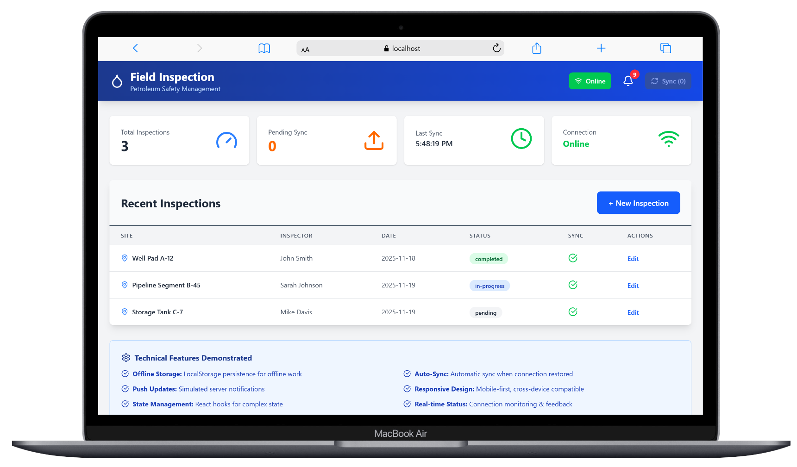
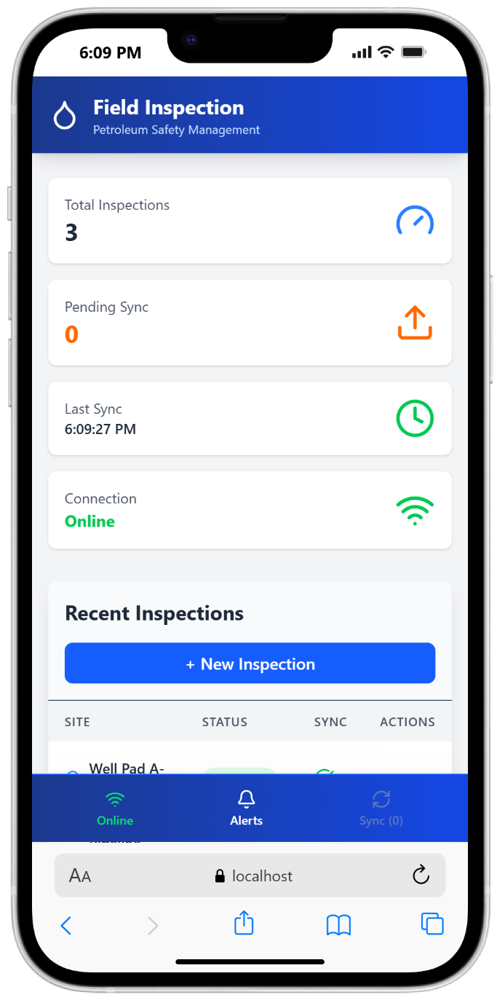

This is a small React + Vite demo app showing:

- Offline-first inspections using `localStorage`
- Pending sync queue and manual sync when back online
- Simulated push notifications from the "server"
- Responsive layout for desktop + mobile, including mobile footer controls
- Online/offline status, last sync time, and sync indicators per inspection

---

- **Mobile data storage & offline sync** – inspections are stored in `localStorage` with a pending sync queue when offline.
- **Online re-synchronization** – when the app is back online, the Sync button (and auto-sync on reconnect) marks pending inspections as synced and updates the UI.
- **Push updates / stale data signals** – a simulated notification system periodically pushes alerts/updates from the “server”.
- **Cross-device compatibility** – responsive layout with a desktop header and mobile bottom bar, tested on both large and small screens.

---

## Screenshots

### Desktop view

### Mobile controls

This project was created as a **code sample for evaluation** and is not intended as production-ready software.
